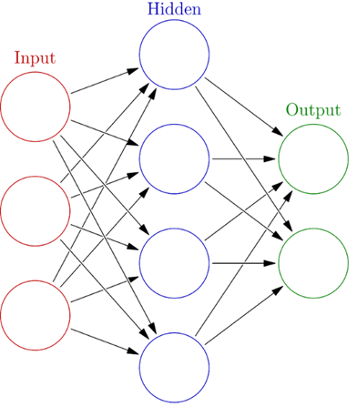
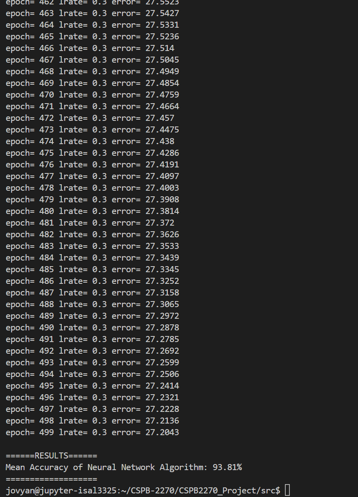

# Introduction to Neural Networks and Backpropagation in C++

This project is an attempt to understand how neural networks work by coding a basic implementation using the C++ standard library (STL). I figured that I will attempt to port an existing python implementation instead of starting from theory. Jason Brownlee has a very good implementation in python which you can check [here](https://machinelearningmastery.com/implement-backpropagation-algorithm-scratch-python/).


<p align="center">
</a>
</p>

## Details

Neural networks can be used for both classification (e.g. prediting colors) or regression (e.g. predicting the temperature). In this case, we use it for classification.

I built a simple neural network with an input layer, a hidden layer and output layer. The output layer usually matches the number of categories (in this case 3) and the input layer should match the numbers of features used to predict the outcome (in this case 7). I chose 5 neurons for the hidden layer.

The neural network takes the input values and multiplies this with the weights of each neuron (plus a bias value) to produce an output. This step is called the feedforward step and then after which we use a sigmoid function (as an activation), the output would be a value between 0 and 1. Once we get the values at the output nodes, we select the node with the maximum value as the winner and predict a category.

Since we are using supervised learning (in other words, we know the correct classification beforehand from the dataset), I use that to calculate the error between the actual and predicted outcome. The error is stored in each neuron as a delta. I then move to the back propagation stage, where we use the delta value to adjust the weights of the neurons from the output layer back to the hidden layer using a method called [gradient descent](https://en.wikipedia.org/wiki/Gradient_descent).

Finally, I use cross validation to train my neural network. I partition the data to 5 parts and use one as a test set and the rest for training and then alternate to make sure that I'm not overfitting (i.e. tweaking my weights to the exact dataset). For each different parition, I calculate the accuracy of my algorithm and then take the mean value.

Here's a video walkthrough of the code:

<p align="center">
<a href="http://www.youtube.com/watch?feature=player_embedded&v=GzHbTmwYQvw
" target="_blank"></a>
</p>

## Dataset

I used the wheat seeds dataset from [here](https://archive.ics.uci.edu/dataset/236/seeds) which based on 7 measurements of wheat seeds, these are being classified into 3 categories.


## Usage

I've tried to make this implmentation as simple as possible. Clone the repo and from the src folder run the following command:

```
g++ main.cpp -o main && ./main
```

## Results

After training and cross validation using the wheat samples dataset, I was able to achieve close to 94% accuracy.

